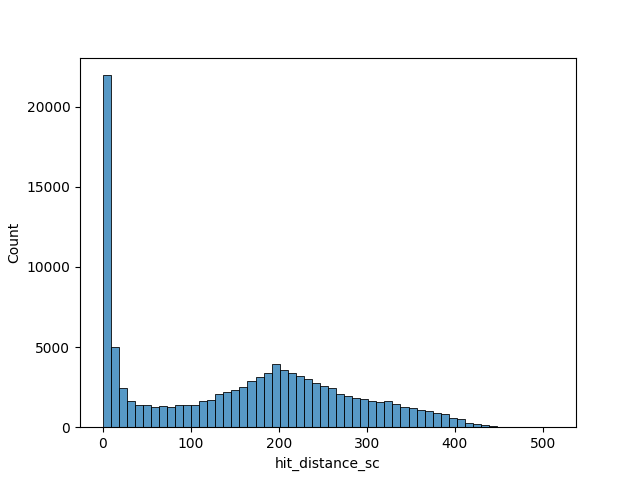
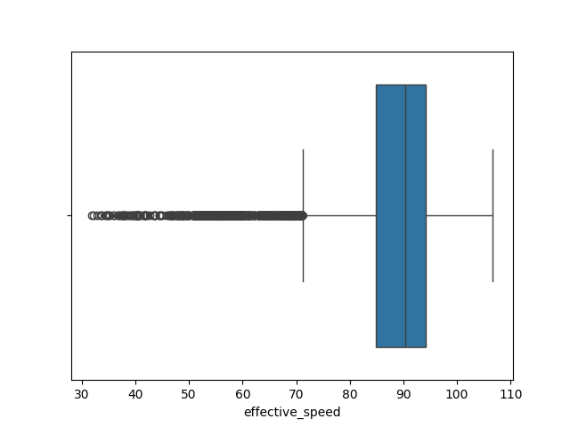
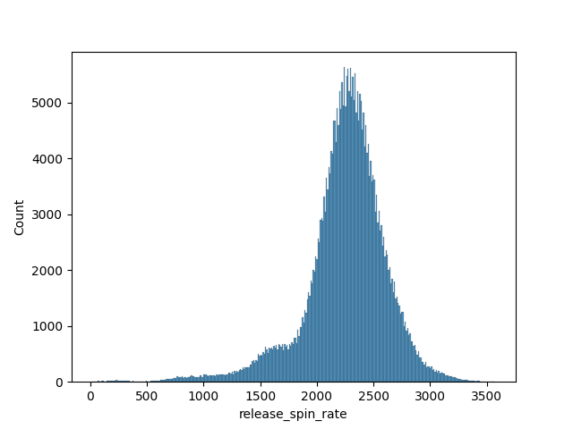
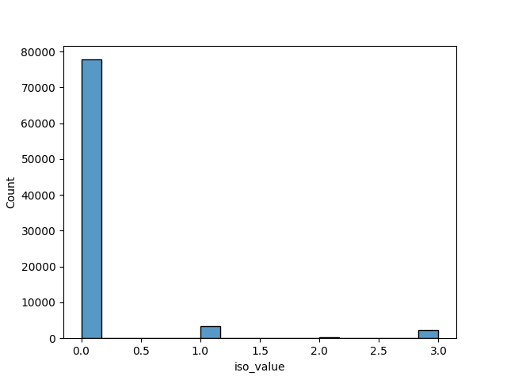
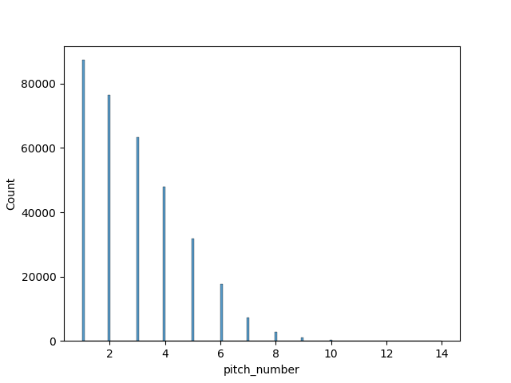
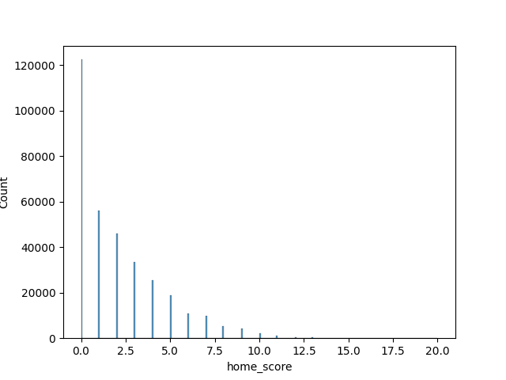

<table border=1>
  <tr >
    <th >
      column
    </th>
    <th >
      description
    </th>
    <th >
      data_type
    </th>
    <th >
      details
    </th>
  </tr>
  <tr >
    <td >
      pitch_type
    </td>
    <td >
      
The type of pitch derived from Statcast.
 
 

    </td>
    <td >
      Categorical(ordering='physical')
    </td>
    <td >
      <ul >
        <li >
          FF
        </li>
        <li >
          CH
        </li>
        <li >
          SI
        </li>
        <li >
          KC
        </li>
        <li >
          SL
        </li>
        <li >
          ST
        </li>
        <li >
          FC
        </li>
        <li >
          CU
        </li>
        <li >
          SV
        </li>
        <li >
          FS
        </li>
        <li >
          PO
        </li>
        <li >
          FO
        </li>
        <li >
          FA
        </li>
        <li >
          KN
        </li>
        <li >
          EP
        </li>
        <li >
          CS
        </li>
        <li >
          ""
        </li>
        
      </ul>
    </td>
  </tr>
  <tr >
    <td >
      game_date
    </td>
    <td >
      
Date of the Game.
 
 

    </td>
    <td >
      Date
    </td>
    <td >
    </td>
  </tr>
  <tr >
    <td >
      release_speed
    </td>
    <td >
      
Pitch velocities from 2008-16 are via Pitch F/X, and adjusted to roughly out-of-hand release point. All velocities from 2017 and beyond are Statcast, which are reported out-of-hand.
 
 

    </td>
    <td >
      Float64
    </td>
    <td >
      
      
    </td>
  </tr>
  <tr >
    <td >
      release_pos_x
    </td>
    <td >
      
Horizontal Release Position of the ball measured in feet from the catcher's perspective.
 
 

    </td>
    <td >
      Float64
    </td>
    <td >
      
      
    </td>
  </tr>
  <tr >
    <td >
      release_pos_z
    </td>
    <td >
      
Vertical Release Position of the ball measured in feet from the catcher's perspective.
 
 

    </td>
    <td >
      Float64
    </td>
    <td >
      
      
    </td>
  </tr>
  <tr >
    <td >
      player_name
    </td>
    <td >
      
Player's name tied to the event of the search.
 
 

    </td>
    <td >
      Categorical(ordering='physical')
    </td>
    <td >
      <ul >
        <li >
          Rocchio, Brayan
        </li>
        <li >
          Ohtani, Shohei
        </li>
        <li >
          Hedges, Austin
        </li>
        <li >
          Casas, Triston
        </li>
        <li >
          Rizzo, Anthony
        </li>
        ...
      </ul>
    </td>
  </tr>
  <tr >
    <td >
      batter
    </td>
    <td >
      
MLB Player Id tied to the play event.
 
 

    </td>
    <td >
      Categorical(ordering='physical')
    </td>
    <td >
      <ul >
        <li >
          677587
        </li>
        <li >
          660271
        </li>
        <li >
          595978
        </li>
        <li >
          671213
        </li>
        <li >
          519203
        </li>
        ...
      </ul>
    </td>
  </tr>
  <tr >
    <td >
      pitcher
    </td>
    <td >
      
MLB Player Id tied to the play event.
 
 

    </td>
    <td >
      Categorical(ordering='physical')
    </td>
    <td >
      <ul >
        <li >
          622491
        </li>
        <li >
          657277
        </li>
        <li >
          622072
        </li>
        <li >
          668678
        </li>
        <li >
          666200
        </li>
        ...
      </ul>
    </td>
  </tr>
  <tr >
    <td >
      events
    </td>
    <td >
      
Event of the resulting Plate Appearance.
 
 

    </td>
    <td >
      Categorical(ordering='physical')
    </td>
    <td >
      <ul >
        <li >
          single
        </li>
        <li >
          ""
        </li>
        <li >
          walk
        </li>
        <li >
          strikeout
        </li>
        <li >
          field_out
        </li>
        <li >
          home_run
        </li>
        <li >
          force_out
        </li>
        <li >
          double
        </li>
        <li >
          field_error
        </li>
        <li >
          grounded_into_double_play
        </li>
        <li >
          hit_by_pitch
        </li>
        <li >
          catcher_interf
        </li>
        <li >
          triple
        </li>
        <li >
          sac_fly
        </li>
        <li >
          double_play
        </li>
        <li >
          sac_bunt
        </li>
        <li >
          fielders_choice
        </li>
        <li >
          caught_stealing_home
        </li>
        <li >
          fielders_choice_out
        </li>
        <li >
          caught_stealing_2b
        </li>
        <li >
          strikeout_double_play
        </li>
        <li >
          stolen_base_2b
        </li>
        <li >
          caught_stealing_3b
        </li>
        <li >
          other_out
        </li>
        <li >
          pickoff_caught_stealing_home
        </li>
        <li >
          pickoff_caught_stealing_3b
        </li>
        <li >
          pickoff_3b
        </li>
        <li >
          sac_fly_double_play
        </li>
        <li >
          pickoff_1b
        </li>
        <li >
          triple_play
        </li>
        
      </ul>
    </td>
  </tr>
  <tr >
    <td >
      description
    </td>
    <td >
      
Description of the resulting pitch.
 
 

    </td>
    <td >
      Categorical(ordering='physical')
    </td>
    <td >
      <ul >
        <li >
          hit_into_play
        </li>
        <li >
          foul
        </li>
        <li >
          called_strike
        </li>
        <li >
          ball
        </li>
        <li >
          foul_tip
        </li>
        <li >
          swinging_strike
        </li>
        <li >
          blocked_ball
        </li>
        <li >
          swinging_strike_blocked
        </li>
        <li >
          hit_by_pitch
        </li>
        <li >
          foul_bunt
        </li>
        <li >
          pitchout
        </li>
        <li >
          missed_bunt
        </li>
        <li >
          bunt_foul_tip
        </li>
        
      </ul>
    </td>
  </tr>
  <tr >
    <td >
      zone
    </td>
    <td >
      
Zone location of the ball when it crosses the plate from the catcher's perspective.
 
 
 

    </td>
    <td >
      UInt8
    </td>
    <td >
      
      
    </td>
  </tr>
  <tr >
    <td >
      des
    </td>
    <td >
      
Plate appearance description from game day.
 
 

    </td>
    <td >
      String
    </td>
    <td >
    </td>
  </tr>
  <tr >
    <td >
      stand
    </td>
    <td >
      
Side of the plate batter is standing.
 
 

    </td>
    <td >
      Categorical(ordering='physical')
    </td>
    <td >
      <ul >
        <li >
          L
        </li>
        <li >
          R
        </li>
        
      </ul>
    </td>
  </tr>
  <tr >
    <td >
      p_throws
    </td>
    <td >
      
Hand pitcher throws with.
 
 

    </td>
    <td >
      Categorical(ordering='physical')
    </td>
    <td >
      <ul >
        <li >
          R
        </li>
        <li >
          L
        </li>
        
      </ul>
    </td>
  </tr>
  <tr >
    <td >
      home_team
    </td>
    <td >
      
Abbreviation of home team.
 
 

    </td>
    <td >
      Categorical(ordering='physical')
    </td>
    <td >
      <ul >
        <li >
          SEA
        </li>
        <li >
          LAD
        </li>
        <li >
          OAK
        </li>
        <li >
          AZ
        </li>
        <li >
          MIA
        </li>
        <li >
          CWS
        </li>
        <li >
          TB
        </li>
        <li >
          CHC
        </li>
        <li >
          MIL
        </li>
        <li >
          HOU
        </li>
        <li >
          SD
        </li>
        <li >
          PHI
        </li>
        <li >
          BAL
        </li>
        <li >
          WSH
        </li>
        <li >
          MIN
        </li>
        <li >
          KC
        </li>
        <li >
          NYM
        </li>
        <li >
          STL
        </li>
        <li >
          SF
        </li>
        <li >
          CIN
        </li>
        <li >
          ATL
        </li>
        <li >
          NYY
        </li>
        <li >
          TEX
        </li>
        <li >
          PIT
        </li>
        <li >
          DET
        </li>
        <li >
          LAA
        </li>
        <li >
          COL
        </li>
        <li >
          TOR
        </li>
        <li >
          CLE
        </li>
        <li >
          BOS
        </li>
        
      </ul>
    </td>
  </tr>
  <tr >
    <td >
      away_team
    </td>
    <td >
      
Abbreviation of away team.
 
 

    </td>
    <td >
      Categorical(ordering='physical')
    </td>
    <td >
      <ul >
        <li >
          CLE
        </li>
        <li >
          SF
        </li>
        <li >
          BOS
        </li>
        <li >
          NYY
        </li>
        <li >
          LAA
        </li>
        <li >
          ATL
        </li>
        <li >
          TEX
        </li>
        <li >
          COL
        </li>
        <li >
          MIN
        </li>
        <li >
          TOR
        </li>
        <li >
          STL
        </li>
        <li >
          CIN
        </li>
        <li >
          KC
        </li>
        <li >
          PIT
        </li>
        <li >
          CWS
        </li>
        <li >
          DET
        </li>
        <li >
          MIA
        </li>
        <li >
          SD
        </li>
        <li >
          NYM
        </li>
        <li >
          AZ
        </li>
        <li >
          HOU
        </li>
        <li >
          BAL
        </li>
        <li >
          PHI
        </li>
        <li >
          SEA
        </li>
        <li >
          OAK
        </li>
        <li >
          TB
        </li>
        <li >
          LAD
        </li>
        <li >
          CHC
        </li>
        <li >
          MIL
        </li>
        <li >
          WSH
        </li>
        
      </ul>
    </td>
  </tr>
  <tr >
    <td >
      type
    </td>
    <td >
      
Short hand of pitch result. B = ball, S = strike, X = in play.
 
 

    </td>
    <td >
      Categorical(ordering='physical')
    </td>
    <td >
      <ul >
        <li >
          X
        </li>
        <li >
          S
        </li>
        <li >
          B
        </li>
        
      </ul>
    </td>
  </tr>
  <tr >
    <td >
      hit_location
    </td>
    <td >
      
Position of first fielder to touch the ball.
 
 

    </td>
    <td >
      UInt8
    </td>
    <td >
      
      
    </td>
  </tr>
  <tr >
    <td >
      bb_type
    </td>
    <td >
      
Batted ball type, ground_ball, line_drive, fly_ball, popup.
 
 

    </td>
    <td >
      Categorical(ordering='physical')
    </td>
    <td >
      <ul >
        <li >
          popup
        </li>
        <li >
          ""
        </li>
        <li >
          ground_ball
        </li>
        <li >
          fly_ball
        </li>
        <li >
          line_drive
        </li>
        
      </ul>
    </td>
  </tr>
  <tr >
    <td >
      balls
    </td>
    <td >
      
Pre-pitch number of balls in count.
 
 

    </td>
    <td >
      UInt8
    </td>
    <td >
      
      
    </td>
  </tr>
  <tr >
    <td >
      strikes
    </td>
    <td >
      
Pre-pitch number of strikes in count.
 
 

    </td>
    <td >
      UInt8
    </td>
    <td >
      
      
    </td>
  </tr>
  <tr >
    <td >
      pfx_x
    </td>
    <td >
      
Horizontal movement in feet from the catcher's perspective.
 
 

    </td>
    <td >
      Float64
    </td>
    <td >
      
      
    </td>
  </tr>
  <tr >
    <td >
      pfx_z
    </td>
    <td >
      
Vertical movement in feet from the catcher's perpsective.
 
 

    </td>
    <td >
      Float64
    </td>
    <td >
      
      
    </td>
  </tr>
  <tr >
    <td >
      plate_x
    </td>
    <td >
      
Horizontal position of the ball when it crosses home plate from the catcher's perspective.
 
 

    </td>
    <td >
      Float64
    </td>
    <td >
      
      
    </td>
  </tr>
  <tr >
    <td >
      plate_z
    </td>
    <td >
      
Vertical position of the ball when it crosses home plate from the catcher's perspective.
 
 

    </td>
    <td >
      Float64
    </td>
    <td >
      
      
    </td>
  </tr>
  <tr >
    <td >
      on_3b
    </td>
    <td >
      
Pre-pitch MLB Player Id of Runner on 3B.
 
 

    </td>
    <td >
      Categorical(ordering='physical')
    </td>
    <td >
      <ul >
        <li >
          ""
        </li>
        <li >
          687263
        </li>
        <li >
          606192
        </li>
        <li >
          681082
        </li>
        <li >
          666969
        </li>
        ...
      </ul>
    </td>
  </tr>
  <tr >
    <td >
      on_2b
    </td>
    <td >
      
Pre-pitch MLB Player Id of Runner on 2B.
 
 

    </td>
    <td >
      Categorical(ordering='physical')
    </td>
    <td >
      <ul >
        <li >
          ""
        </li>
        <li >
          687263
        </li>
        <li >
          666158
        </li>
        <li >
          453568
        </li>
        <li >
          669397
        </li>
        ...
      </ul>
    </td>
  </tr>
  <tr >
    <td >
      on_1b
    </td>
    <td >
      
Pre-pitch MLB Player Id of Runner on 1B.
 
 

    </td>
    <td >
      Categorical(ordering='physical')
    </td>
    <td >
      <ul >
        <li >
          ""
        </li>
        <li >
          666310
        </li>
        <li >
          571771
        </li>
        <li >
          665742
        </li>
        <li >
          650490
        </li>
        ...
      </ul>
    </td>
  </tr>
  <tr >
    <td >
      outs_when_up
    </td>
    <td >
      
Pre-pitch number of outs.
 
 

    </td>
    <td >
      UInt8
    </td>
    <td >
      
      
    </td>
  </tr>
  <tr >
    <td >
      inning
    </td>
    <td >
      
Pre-pitch inning number.
 
 

    </td>
    <td >
      UInt8
    </td>
    <td >
      
      
    </td>
  </tr>
  <tr >
    <td >
      inning_topbot
    </td>
    <td >
      
Pre-pitch top or bottom of inning.
 
 

    </td>
    <td >
      Categorical(ordering='physical')
    </td>
    <td >
      <ul >
        <li >
          Top
        </li>
        <li >
          Bot
        </li>
        
      </ul>
    </td>
  </tr>
  <tr >
    <td >
      hc_x
    </td>
    <td >
      
Hit coordinate X of batted ball.
 
 

    </td>
    <td >
      Float64
    </td>
    <td >
      
      
    </td>
  </tr>
  <tr >
    <td >
      hc_y
    </td>
    <td >
      
Hit coordinate Y of batted ball.
 
 

    </td>
    <td >
      Float64
    </td>
    <td >
      
      
    </td>
  </tr>
  <tr >
    <td >
      fielder_2
    </td>
    <td >
      
MLB Player Id for catcher.
 
 

    </td>
    <td >
      UInt32
    </td>
    <td >
      
      
    </td>
  </tr>
  <tr >
    <td >
      vx0
    </td>
    <td >
      
The velocity of the pitch, in feet per second, in x-dimension, determined at y=50 feet.
 
 

    </td>
    <td >
      Float64
    </td>
    <td >
      
      
    </td>
  </tr>
  <tr >
    <td >
      vy0
    </td>
    <td >
      
The velocity of the pitch, in feet per second, in y-dimension, determined at y=50 feet.
 
 

    </td>
    <td >
      Float64
    </td>
    <td >
      
      
    </td>
  </tr>
  <tr >
    <td >
      vz0
    </td>
    <td >
      
The velocity of the pitch, in feet per second, in z-dimension, determined at y=50 feet.
 
 

    </td>
    <td >
      Float64
    </td>
    <td >
      
      
    </td>
  </tr>
  <tr >
    <td >
      ax
    </td>
    <td >
      
The acceleration of the pitch, in feet per second per second, in x-dimension, determined at y=50 feet.
 
 

    </td>
    <td >
      Float64
    </td>
    <td >
      
      
    </td>
  </tr>
  <tr >
    <td >
      ay
    </td>
    <td >
      
The acceleration of the pitch, in feet per second per second, in y-dimension, determined at y=50 feet.
 
 

    </td>
    <td >
      Float64
    </td>
    <td >
      
      
    </td>
  </tr>
  <tr >
    <td >
      az
    </td>
    <td >
      
The acceleration of the pitch, in feet per second per second, in z-dimension, determined at y=50 feet.
 
 

    </td>
    <td >
      Float64
    </td>
    <td >
      
      
    </td>
  </tr>
  <tr >
    <td >
      sz_top
    </td>
    <td >
      
Top of the batter's strike zone set by the operator when the ball is halfway to the plate.
 
 

    </td>
    <td >
      Float64
    </td>
    <td >
      
      
    </td>
  </tr>
  <tr >
    <td >
      sz_bot
    </td>
    <td >
      
Bottom of the batter's strike zone set by the operator when the ball is halfway to the plate.
 
 

    </td>
    <td >
      Float64
    </td>
    <td >
      
      
    </td>
  </tr>
  <tr >
    <td >
      hit_distance_sc
    </td>
    <td >
    </td>
    <td >
      UInt16
    </td>
    <td >
      
      
    </td>
  </tr>
  <tr >
    <td >
      launch_speed
    </td>
    <td >
      
Exit velocity of the batted ball as tracked by Statcast. For the limited subset of batted balls not tracked directly, estimates are included based on the process described here.
 
 

    </td>
    <td >
      Float64
    </td>
    <td >
      
      
    </td>
  </tr>
  <tr >
    <td >
      launch_angle
    </td>
    <td >
      
Launch angle of the batted ball as tracked by Statcast. For the limited subset of batted balls not tracked directly, estimates are included based on the process described here.
 
 

    </td>
    <td >
      Int8
    </td>
    <td >
      
      
    </td>
  </tr>
  <tr >
    <td >
      effective_speed
    </td>
    <td >
      
Derived speed based on the the extension of the pitcher's release.
 
 

    </td>
    <td >
      Float64
    </td>
    <td >
      
      
    </td>
  </tr>
  <tr >
    <td >
      release_spin_rate
    </td>
    <td >
    </td>
    <td >
      UInt16
    </td>
    <td >
      
      
    </td>
  </tr>
  <tr >
    <td >
      release_extension
    </td>
    <td >
      
Release extension of pitch in feet as tracked by Statcast.
 
 

    </td>
    <td >
      Float64
    </td>
    <td >
      
      
    </td>
  </tr>
  <tr >
    <td >
      game_pk
    </td>
    <td >
      
Unique Id for Game.
 
 

    </td>
    <td >
      UInt32
    </td>
    <td >
      
      
    </td>
  </tr>
  <tr >
    <td >
      pitcher_1
    </td>
    <td >
    </td>
    <td >
      Categorical(ordering='physical')
    </td>
    <td >
      <ul >
        <li >
          622491
        </li>
        <li >
          657277
        </li>
        <li >
          622072
        </li>
        <li >
          668678
        </li>
        <li >
          666200
        </li>
        ...
      </ul>
    </td>
  </tr>
  <tr >
    <td >
      fielder_2_1
    </td>
    <td >
    </td>
    <td >
      Categorical(ordering='physical')
    </td>
    <td >
      <ul >
        <li >
          663728
        </li>
        <li >
          672275
        </li>
        <li >
          669127
        </li>
        <li >
          672515
        </li>
        <li >
          663743
        </li>
        ...
      </ul>
    </td>
  </tr>
  <tr >
    <td >
      fielder_3
    </td>
    <td >
      
MLB Player Id for 1B.
 
 

    </td>
    <td >
      Categorical(ordering='physical')
    </td>
    <td >
      <ul >
        <li >
          664034
        </li>
        <li >
          527038
        </li>
        <li >
          676116
        </li>
        <li >
          572233
        </li>
        <li >
          669394
        </li>
        ...
      </ul>
    </td>
  </tr>
  <tr >
    <td >
      fielder_4
    </td>
    <td >
      
MLB Player Id for 2B.
 
 

    </td>
    <td >
      Categorical(ordering='physical')
    </td>
    <td >
      <ul >
        <li >
          593871
        </li>
        <li >
          642731
        </li>
        <li >
          680869
        </li>
        <li >
          606466
        </li>
        <li >
          650333
        </li>
        ...
      </ul>
    </td>
  </tr>
  <tr >
    <td >
      fielder_5
    </td>
    <td >
      
MLB Player Id for 3B.
 
 

    </td>
    <td >
      Categorical(ordering='physical')
    </td>
    <td >
      <ul >
        <li >
          668942
        </li>
        <li >
          656305
        </li>
        <li >
          605204
        </li>
        <li >
          553993
        </li>
        <li >
          681146
        </li>
        ...
      </ul>
    </td>
  </tr>
  <tr >
    <td >
      fielder_6
    </td>
    <td >
      
MLB Player Id for SS.
 
 

    </td>
    <td >
      Categorical(ordering='physical')
    </td>
    <td >
      <ul >
        <li >
          641487
        </li>
        <li >
          605113
        </li>
        <li >
          669397
        </li>
        <li >
          672695
        </li>
        <li >
          641313
        </li>
        ...
      </ul>
    </td>
  </tr>
  <tr >
    <td >
      fielder_7
    </td>
    <td >
      
MLB Player Id for LF.
 
 

    </td>
    <td >
      Categorical(ordering='physical')
    </td>
    <td >
      <ul >
        <li >
          686527
        </li>
        <li >
          624424
        </li>
        <li >
          664913
        </li>
        <li >
          666971
        </li>
        <li >
          650559
        </li>
        ...
      </ul>
    </td>
  </tr>
  <tr >
    <td >
      fielder_8
    </td>
    <td >
      
MLB Player Id for CF.
 
 

    </td>
    <td >
      Categorical(ordering='physical')
    </td>
    <td >
      <ul >
        <li >
          677594
        </li>
        <li >
          808982
        </li>
        <li >
          668709
        </li>
        <li >
          678489
        </li>
        <li >
          665862
        </li>
        ...
      </ul>
    </td>
  </tr>
  <tr >
    <td >
      fielder_9
    </td>
    <td >
      
MLB Player Id for RF.
 
 

    </td>
    <td >
      Categorical(ordering='physical')
    </td>
    <td >
      <ul >
        <li >
          571745
        </li>
        <li >
          573262
        </li>
        <li >
          671732
        </li>
        <li >
          664983
        </li>
        <li >
          541645
        </li>
        ...
      </ul>
    </td>
  </tr>
  <tr >
    <td >
      release_pos_y
    </td>
    <td >
      
Release position of pitch measured in feet from the catcher's perspective.
 
 

    </td>
    <td >
      Float64
    </td>
    <td >
      
      
    </td>
  </tr>
  <tr >
    <td >
      estimated_ba_using_speedangle
    </td>
    <td >
      
Estimated Batting Avg based on launch angle and exit velocity.
 
 

    </td>
    <td >
      Float64
    </td>
    <td >
      
      
    </td>
  </tr>
  <tr >
    <td >
      estimated_woba_using_speedangle
    </td>
    <td >
      
Estimated wOBA based on launch angle and exit velocity.
 
 

    </td>
    <td >
      Float64
    </td>
    <td >
      
      
    </td>
  </tr>
  <tr >
    <td >
      woba_value
    </td>
    <td >
      
wOBA value based on result of play.
 
 

    </td>
    <td >
      Float64
    </td>
    <td >
      
      
    </td>
  </tr>
  <tr >
    <td >
      woba_denom
    </td>
    <td >
      
wOBA denominator based on result of play.
 
 

    </td>
    <td >
      UInt8
    </td>
    <td >
      
      
    </td>
  </tr>
  <tr >
    <td >
      babip_value
    </td>
    <td >
      
BABIP value based on result of play.
 
 

    </td>
    <td >
      UInt8
    </td>
    <td >
      
      
    </td>
  </tr>
  <tr >
    <td >
      iso_value
    </td>
    <td >
      
ISO value based on result of play.
 
 

    </td>
    <td >
      UInt8
    </td>
    <td >
      
      
    </td>
  </tr>
  <tr >
    <td >
      launch_speed_angle
    </td>
    <td >
      
Launch speed/angle zone based on launch angle and exit velocity.
 1: Weak
 2: Topped
 3: Under
 4: Flare/Burner
 5: Solid Contact
 6: Barrel
 
 
 

    </td>
    <td >
      UInt8
    </td>
    <td >
      
      
    </td>
  </tr>
  <tr >
    <td >
      at_bat_number
    </td>
    <td >
      
Plate appearance number of the game.
 
 

    </td>
    <td >
      UInt8
    </td>
    <td >
      
      
    </td>
  </tr>
  <tr >
    <td >
      pitch_number
    </td>
    <td >
      
Total pitch number of the plate appearance.
 
 

    </td>
    <td >
      UInt8
    </td>
    <td >
      
      
    </td>
  </tr>
  <tr >
    <td >
      pitch_name
    </td>
    <td >
      
The name of the pitch derived from the Statcast Data.
 
 

    </td>
    <td >
      Categorical(ordering='physical')
    </td>
    <td >
      <ul >
        <li >
          4-Seam Fastball
        </li>
        <li >
          Changeup
        </li>
        <li >
          Sinker
        </li>
        <li >
          Knuckle Curve
        </li>
        <li >
          Slider
        </li>
        <li >
          Sweeper
        </li>
        <li >
          Cutter
        </li>
        <li >
          Curveball
        </li>
        <li >
          Slurve
        </li>
        <li >
          Split-Finger
        </li>
        <li >
          Pitch Out
        </li>
        <li >
          Forkball
        </li>
        <li >
          Other
        </li>
        <li >
          Knuckleball
        </li>
        <li >
          Eephus
        </li>
        <li >
          Slow Curve
        </li>
        <li >
          ""
        </li>
        
      </ul>
    </td>
  </tr>
  <tr >
    <td >
      home_score
    </td>
    <td >
      
Pre-pitch home score
 
 

    </td>
    <td >
      UInt8
    </td>
    <td >
      
      
    </td>
  </tr>
  <tr >
    <td >
      away_score
    </td>
    <td >
      
Pre-pitch away score
 
 

    </td>
    <td >
      UInt8
    </td>
    <td >
      
      
    </td>
  </tr>
  <tr >
    <td >
      bat_score
    </td>
    <td >
      
Pre-pitch bat team score
 
 

    </td>
    <td >
      UInt8
    </td>
    <td >
      
      
    </td>
  </tr>
  <tr >
    <td >
      fld_score
    </td>
    <td >
      
Pre-pitch field team score
 
 

    </td>
    <td >
      UInt8
    </td>
    <td >
      
      
    </td>
  </tr>
  <tr >
    <td >
      post_away_score
    </td>
    <td >
      
Post-pitch away score
 
 

    </td>
    <td >
      UInt8
    </td>
    <td >
      
      
    </td>
  </tr>
  <tr >
    <td >
      post_home_score
    </td>
    <td >
      
Post-pitch home score
 
 

    </td>
    <td >
      UInt8
    </td>
    <td >
      
      
    </td>
  </tr>
  <tr >
    <td >
      post_bat_score
    </td>
    <td >
      
Post-pitch bat team score
 
 

    </td>
    <td >
      UInt8
    </td>
    <td >
      
      
    </td>
  </tr>
  <tr >
    <td >
      post_fld_score
    </td>
    <td >
    </td>
    <td >
      UInt8
    </td>
    <td >
      
      
    </td>
  </tr>
  <tr >
    <td >
      if_fielding_alignment
    </td>
    <td >
      
Infield fielding alignment at the time of the pitch.
 
 

    </td>
    <td >
      Categorical(ordering='physical')
    </td>
    <td >
      <ul >
        <li >
          Infield shade
        </li>
        <li >
          Standard
        </li>
        <li >
          Strategic
        </li>
        <li >
          ""
        </li>
        
      </ul>
    </td>
  </tr>
  <tr >
    <td >
      of_fielding_alignment
    </td>
    <td >
      
Outfield fielding alignment at the time of the pitch.
 
 

    </td>
    <td >
      Categorical(ordering='physical')
    </td>
    <td >
      <ul >
        <li >
          Standard
        </li>
        <li >
          Strategic
        </li>
        <li >
          ""
        </li>
        
      </ul>
    </td>
  </tr>
  <tr >
    <td >
      spin_axis
    </td>
    <td >
      
The Spin Axis in the 2D X-Z plane in degrees from 0 to 360, such that 180 represents a pure backspin fastball and 0 degrees represents a pure topspin (12-6) curveball
 
 

    </td>
    <td >
      UInt16
    </td>
    <td >
      
      
    </td>
  </tr>
  <tr >
    <td >
      delta_home_win_exp
    </td>
    <td >
      
The change in Win Expectancy before the Plate Appearance and after the Plate Appearance
 
 

    </td>
    <td >
      Float64
    </td>
    <td >
      
      
    </td>
  </tr>
  <tr >
    <td >
      delta_run_exp
    </td>
    <td >
      
The change in Run Expectancy before the Pitch and after the Pitch
 
 

    </td>
    <td >
      Float64
    </td>
    <td >
      
      
    </td>
  </tr>
  <tr >
    <td >
      bat_speed
    </td>
    <td >
      
Bat speed is measured at the sweet-spot of the bat. Average bat speed is the average of the top 90% of a player’s swings. 
    </td>
    <td >
      Float64
    </td>
    <td >
      
      
    </td>
  </tr>
  <tr >
    <td >
      swing_length
    </td>
    <td >
      
The total (sum) distance in feet traveled of the head of the bat in X/Y/Z space, from start of tracking data until impact point.
 
 

    </td>
    <td >
      Float64
    </td>
    <td >
      
      
    </td>
  </tr>
  <tr >
    <td >
      swing_event
    </td>
    <td >
    </td>
    <td >
      Boolean
    </td>
    <td >
    </td>
  </tr>
  <tr >
    <td >
      hit_into_play
    </td>
    <td >
    </td>
    <td >
      Boolean
    </td>
    <td >
    </td>
  </tr>
  <tr >
    <td >
      bat_speed_bin
    </td>
    <td >
    </td>
    <td >
      Categorical(ordering='physical')
    </td>
    <td >
      <ul >
        <li >
          ""
        </li>
        <li >
          0.851208400756372
        </li>
        <li >
          2.851208400756372
        </li>
        <li >
          4.851208400756372
        </li>
        <li >
          6.851208400756371
        </li>
        ...
      </ul>
    </td>
  </tr>
  <tr >
    <td >
      swing_length_bin
    </td>
    <td >
    </td>
    <td >
      Categorical(ordering='physical')
    </td>
    <td >
      <ul >
        <li >
          ""
        </li>
        <li >
          0.30587
        </li>
        <li >
          0.40586999999999995
        </li>
        <li >
          0.5058699999999999
        </li>
        <li >
          0.6058699999999999
        </li>
        ...
      </ul>
    </td>
  </tr>
</table>
